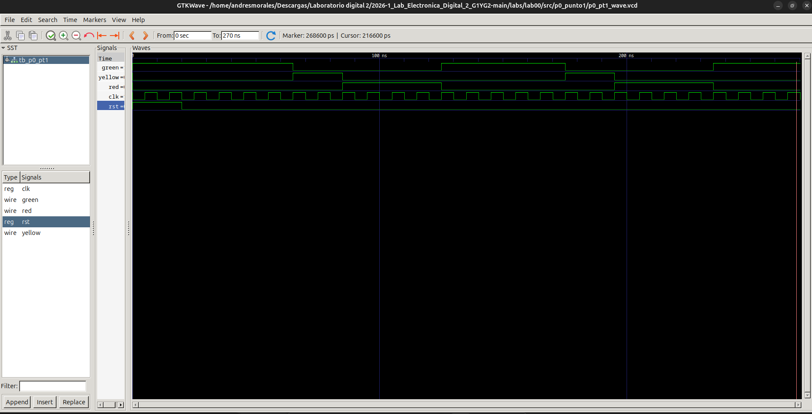
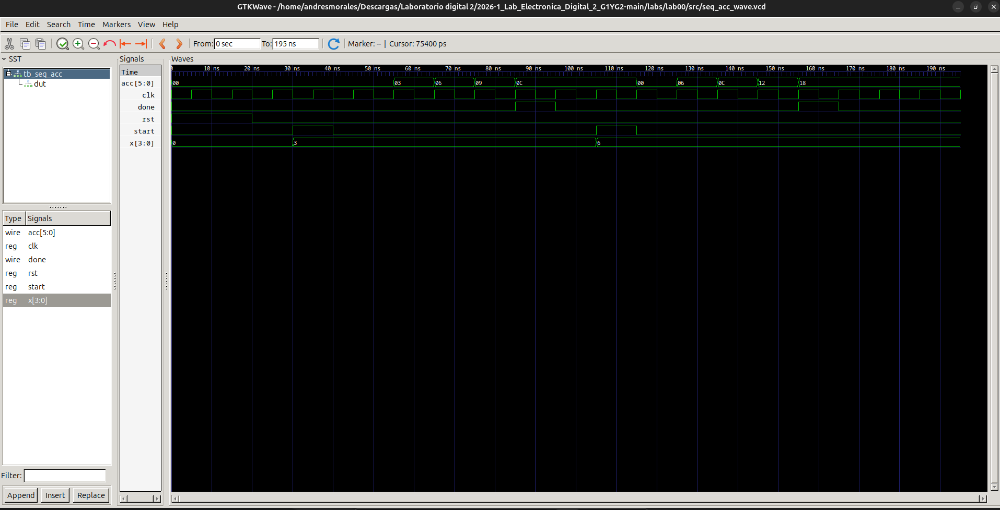
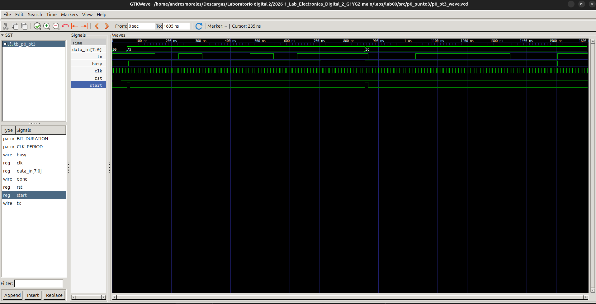

# 2026-1_Lab_Electrónica_Digital_2_G1YG2

## Autor
- Andrés Morales

## Informe 0 - Introducción a Verilog, Simulación y Máquinas de Estados Finitos (FSM)

## Índice
- [Diseños implementados](#diseños-implementados)
- [Simulaciones](#simulaciones)
- [Conclusiones](#conclusiones)

## Diseños implementados
En esta práctica se desarrollaron tres ejercicios enfocados en el uso de Verilog, el diseño de máquinas de estados finitos (FSM) y la integración de arquitecturas Datapath-Control (ASM).

### 1. Semáforo Simple (FSM de control)
Se implementó un controlador para un semáforo utilizando una máquina de estados de tipo Moore. El sistema cuenta con tres estados (`S0_VERDE`, `S1_AMARILLO`, `S2_ROJO`) y un contador interno (`timer`) para mantener cada luz encendida durante el número de ciclos de reloj requeridos (5 para verde, 2 para amarillo y 4 para rojo).

### 2. Acumulador Secuencial (FSM con Datapath)
Se diseñó un sistema secuencial que acumula un valor de entrada `x` de 4 bits. Para nuestro grupo, se implementó la variante de **sumar el valor 4 veces**. El diseño consta de una FSM que controla el flujo (estados `IDLE`, `LOAD`, `ADD`, `DONE`) y un datapath que incluye un registro acumulador y un contador de iteraciones. 

### 3. Transmisor Serial (ASM Completa)
Se desarrolló un transmisor síncrono de 8 bits que integra control y datapath. Se configuró para que cada bit transmitido tenga una duración de 8 ciclos de reloj (`CLKS_PER_BIT = 8`). El datapath utiliza un registro de desplazamiento (`shift_reg`) para enviar el bit menos significativo y un contador (`tick_cnt`) que garantiza la duración temporal de cada bit en la línea `tx`.

## Simulaciones

### 1. Semáforo Simple
En la simulación del semáforo, inicialmente se aplica un reset y el módulo arranca en luz verde. Como se observa en la onda de simulación, cada una de las transiciones repite los ciclos de reloj definidos para cada color (verde = 5, amarillo = 2, rojo = 4), avanzando de forma continua.  

### 2. Acumulador Secuencial
Para comprobar el módulo del acumulador, usamos un testbench que envía la señal de `start` y un dato (por ejemplo, `3` y `6`). El proceso toma 4 ciclos consecutivos sumando el valor de entrada a un registro de 6 bits que inicialmente es 0, hasta acumular exitosamente 12 o 24.  

### 3. Transmisor Serial
La simulación del transmisor evidencia un ciclo íntegro donde la señal `start` envía un byte (`8'hA5` o `10100101`). La señal `busy` activa la alerta de transmisión en curso, mientras que la salida `tx` transmite correctamente el dato bit a bit con tiempos muy exactos (8 ticks de reloj para cada uno), arrojando el pulso en la señal `done` al finalizar.  

## Conclusiones
- Las máquinas de estados finitos (FSM) ofrecen una metodología organizada e ideal para describir comportamientos que cambian a lo largo del tiempo, separando el control y los datos del diseño.
- La distinción clara entre Datapath (registros y operaciones aritméticas) y la FSM permite crear un diseño mucho más entendible y modular.
- Desarrollar las simulaciones usando `iverilog` y visualizar los pulsos de reloj y variables internas de Verilog con GTKWave fue fundamental para detectar errores temporales tempranos antes de considerar su despliegue físico.
